# Tests unitaires et typage de code source

Un contenu complémentaire à la **Programmation linéaire, recherche opérationnelle et algorithmique**: <a href="https://github.com/ugolabo/programmation_lineaire_algorithmique">bouton droit vers repo</a>

**Objectif:** poursuivre avec la programmation orientée objet et de l'algorithmique comme base des algorithmes de *Machine Learning* et de *Deep Learning*; maitriser les fondements des tests unitaires, aborder le typage d'un code source; appliquer les tests unitaires et le typage à un problème de satisfaction de contraintes (*CSP*); appliquer la programmation linéaire mixte à ce problème.

[Cas de figure](#cas-de-figure-de-tests-unitaires-et-de-typage) de tests unitaires et de typage à la toute fin.

1. Programmation orientée objet et plus: poursuivre avec la documentation du code avec les doctest; valider les classes, les constructeurs, les attributs et les méthodes avec des doctests et des pytests, produire le rapport de couverture des pytests; aborder la matière des tests d'intégration et des tests fonctionnels; améliorer le code source Python avec le typage des assignations et des résultats, puis valider avec Mypy

|    |    |    |
|:---|:---|:---|
| 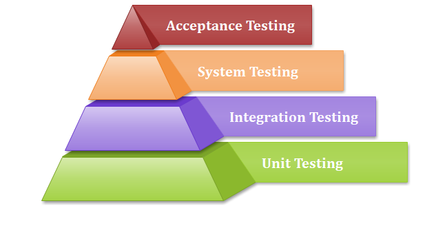   | 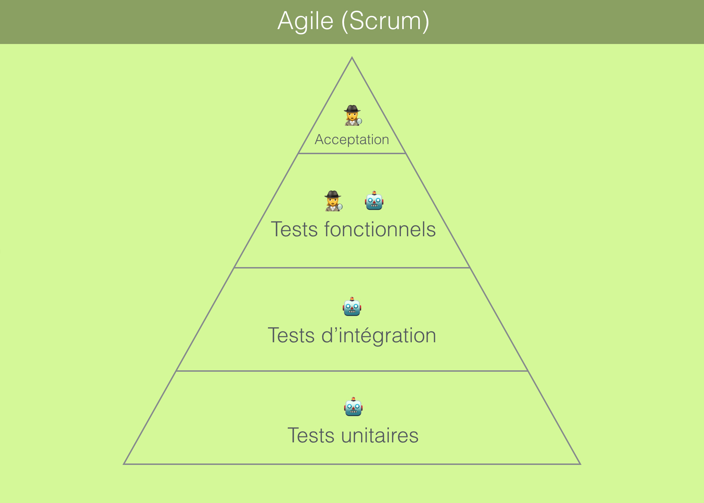   | 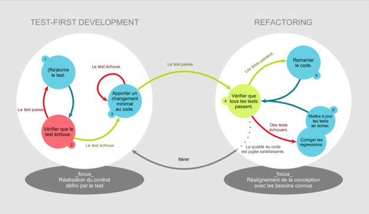   |

2. Algorithmique et structures linéaires: poursuivre avec la programmation dynamique et la récursivité, les piles (stacks), les files (queues) et leurs applications en programmation; travailler avec des piles et des files avec des fonctions récursives et des décorateurs

|    |    |    |
|:---|:---|:---|
| 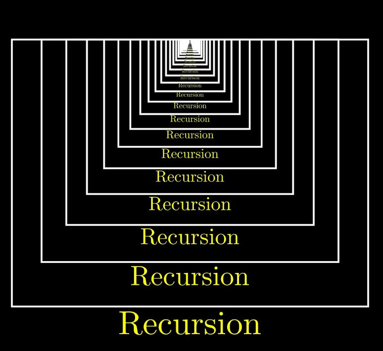   | 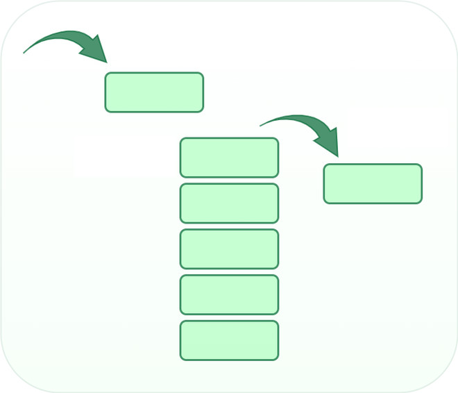  | 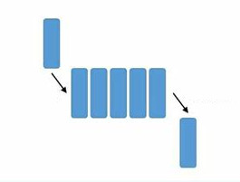  |
|    | 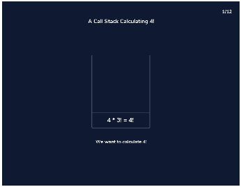  | 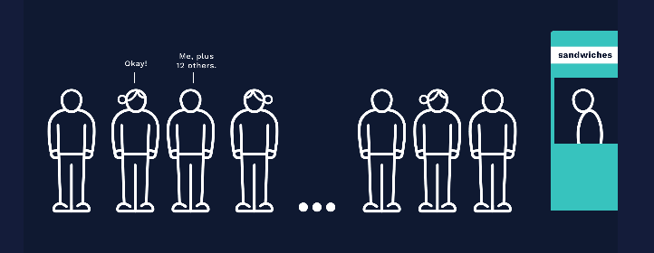  |

3. Algorithmique et structures complexes: aborder les algorithmes les arbres (arbre binomial, *Heap* et autres arbres), les graphes et leurs applications en programmation, en *Machine Learning* (comme les arbres de décision, par exemple), en *Deep Learning* (graphes de calculs de TensorFlow, par exemple); travailler avec des arbres (racine, nœuds, arêtes, algorithmes de calcul de hauteur, de profondeur, de taille, de largeur, algorithmes de traversée infixe, préfixe et suffixe, algorithmes  de recherche, d'insertion, de suppression, de mise à jour); travailler avec un graphe (nœuds, arcs, orientés ou non, pondérés ou non, matrice d'adjacence, algorithme de boucle ou cycle de déplacement, algorithmes de calcul en largeur, en profondeur, algorithmes de recherche du chemin le plus court comme A*, Dijkstra, etc., ajout de coûts ou une distance de déplacement, algorithmes de recherche informée par une heuristique avec Best-first, Greedy Best-First, A*, IDA*, RDFS, SMA*, hill-climbing, à faisceau, génétique, Dijkstra et une distance euclidienne, de Manhattan, etc.

|    |    |    |
|:---|:---|:---|
|    |    |    |
|    |    | 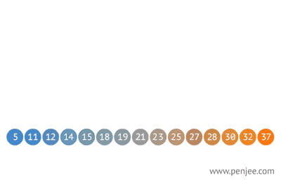   |

|    |    |    |
|:---|:---|:---|
|    | 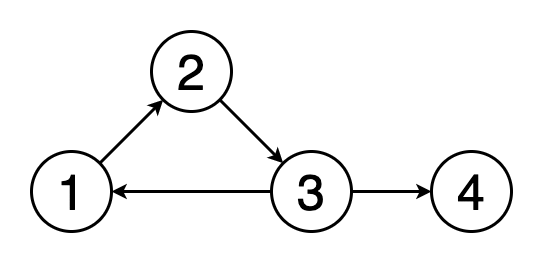   |    |
|    |    |    |

Le fichier Recursion with Python.html (adjacent à ce fichier README.md; télécharger tout le repo pour pouvoir l'ouvrir) est une compilation de codes sources sur des algorithmes et des structures.

## Cas de figure de tests unitaires et de typage

Le fichier pres.html (adjacent à ce fichier README.md; télécharger tout le repo pour pouvoir l'ouvrir) résumer le cas.

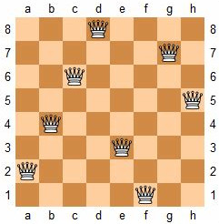

Le cas utilise un problème de satisfaction de contraintes (*CSP*) pour solutionner le problème classique des *nQueens* (n étant le nombre de dames, de 3 à 8). Ce cas comporte un algorithme CSP générique (csp_v2.py) et son application au problème des *nQueens* (queens_v2.py). Les fichiers eva_....txt sont des évaluations de performance de deux approches: BS et BS2 (pour évaluer le nombre de lignes de codes que la solution d'un problème imprime). Des doctests sont associés à chaque fichier Python (doctest_....md). Comme les doctests servent aussi à documenter, il existe des versions HTML (doctest_....html) qui montrent une documentation minimale. Des pytests sont associés à chaque fichier Python (pytest_....py). La couverture des pytests est contenue dans le fichier coverage_test_csp.txt. Le fichier PNG est l'image finale obtenue à la fin de la dernière solution obtenue par csp_v2.py

Les codes sources sont aussi typés pour contrôler les entrées et les sorties des objets; on peut valider le typage avec Mypy.

Le fichier pres.html (adjacent à ce fichier README.md; télécharger tout le repo pour pouvoir l'ouvrir) montre des comparatifs de performance et démontre la vitesse de Python-MIP. L'évaluation avec MIP est faite avec le fichier nqueens_mip.py (adjacent à ce fichier README.md).

Les *CSP* datent, mais ce sont des algorithmes proches de la programmation linéaire (PuLP et Python-MIP) et mixte (Python-MIP) ainsi que de la recherche opérationnelle. Les *CSP* ont été utilisés pour des problème de coloration de territoires sur une carte, d'assignation, de planification et de transport. Tous ces algorithmes font partie, avec les approches à base de statistiques, du *Machine Learning*.

